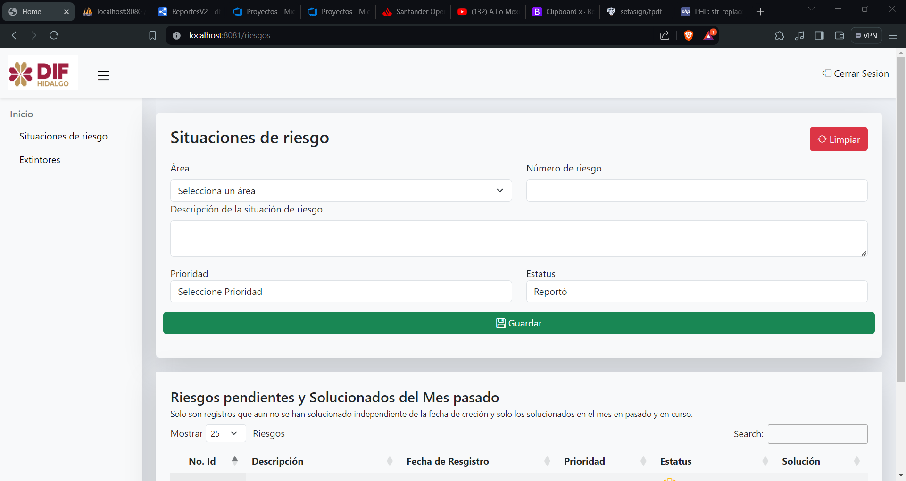
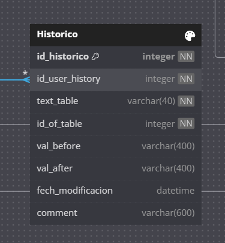

# Documentación 

La configuración, de la base datos consta de un atabla principál el cual guarda todos los registros que se generen en todas la demas tablas 

## Propuesta 
Vista donde se puedean generar riesgos, y mostrar los riesgos reportafos y solucionados del mes en curso y del mes pasado. Ya que muchos registros se repiten con més, solo se toman en cuenta los  
**Vista Riesgos**

Solo se añadiran los datos que se muestran en el formulario que demas datos parte del reporte se ingresan de manera automatica:
- Fecha de cuando se genero el reporte 
- Fecha cuando se soluciono el reporte
- Usuario quien creo el reporte
- Usuario quien modifico el reporte

> Nota: Número de reporte aun no se si sera de manera automatica o tiene un control interno en el área

### Historico
Como parte del control de cambios y de historial se genero una tabla en el cual esta la información de todos los cambios que se hacen en cada tabla independiente 
- `d_user_history` => Usuario quien genera el cambio
- `text_table` => nombre de la tabla a la que se genero  el cambio
- `d_of_table` => id del resgistro al que se modico los valores
- `val_before` => valor anterior 
- `val_after` => Nuevo valor del  resgistro 
- `fech_modificacion` => Fecha de actualizacion al registro de la tabla 

> Esta tabla solo sera para obtener un historial  de cambios en los registros 
> Los valores de antes y el después es varchar para que se pueda introducir , cualquier valor 

>Diagrama Entidad Relacion
>https://dbdiagram.io/d/ReportesV2-6614683603593b6b6181deea
